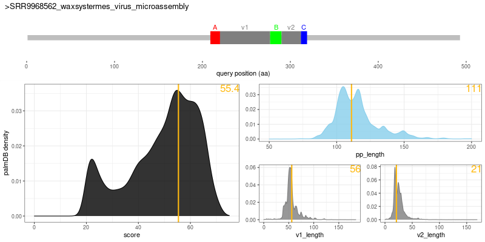
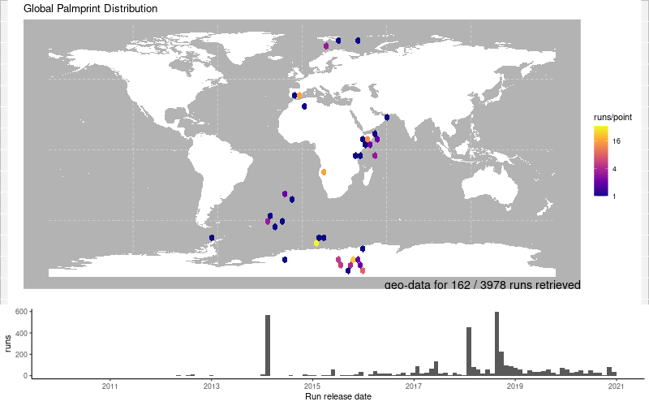

## Introduction

`palmid` is a containerized analysis suite and R-package for the classification of **viral RNA-dependent RNA Polymerases (RdRP)** based on the **palmprint** sub-domain and the RNA viral palmprint database [`palmdb`](https://github.com/rcedgar/palmdb).

#### 


```
RdRP Palmprint
=============================================
The `palmprint` is an ~100 aa segment of RdRP
encompassing three conserved catalytic motifs
"A", "B", and "C" within the palm sub-domain.


```
## Web Version

`palmID` is available as a free web-app at [https://serratus.io/palmid](https://serratus.io/palmid)

## Install

`palmid` (container)
```bash
# Download the `palmid` container
sudo docker pull serratusbio/palmid:latest

```

```bash
# Alternative: build container locally

# Clone repository
git clone https://github.com/ababaian/palmid.git && cd palmid

# Requires `docker` (>= v20.10)
sudo docker build -t serratusbio/palmid:latest ./

```

`palmid` (R package)

```R
# R (>= v4.0.3)
# Install dependencies
install.packages("devtools")
devtools::install_github("ababaian/palmid")

# Load libraries
library("palmid")

# Install Mapping Functions for static maps (optional)
#  'libudunits2-dev' and geo system libraries needed
#   sudo apt-get install -y  libudunits2-dev \
#                            libgdal-dev     \ 
#                            libgeos-dev     \
#                            libproj-dev     \
install.packages("sf")
install.packages("rnaturalearth")

```

## Usage

### 0) Input

Input a `.fa` sequence file containing an RdRP. Here we show a 'microassembly' open-reading-frame from a sequencing library of _Waxsystermes_ termites (`SRR9968562`) as derived from the [`Serratus`: Finding Novel Viruses Tutorial](https://github.com/ababaian/serratus/wiki/Find_novel_viruses).


`data/waxsys.fa`
```
>SRR9968562_waxsystermes_virus_microassembly
PIWDRVLEPLMRASPGIGRYMLTDVSPVGLLRVFKEKVDTTPHMPPEGMEDFKKASKEVE
KTLPTTLRELSWDEVKEMIRNDAAVGDPRWKTALEAKESEEFWREVQAEDLNHRNGVCLR
GVFHTMAKREKKEKNKWGQKTSRMIAYYDLIERACEMRTLGALNADHWAGEENTPEGVSG
IPQHLYGEKALNRLKMNRMTGETTEGQVFQGDIAGWDTRVSEYELQNEQRICEERAESED
HRRKIRTIYECYRSPIIRVQDADGNLMWLHGRGQRMSGTIVTYAMNTITNAIIQQAVSKD
LGNTYGRENRLISGDDCLVLYDTQHPEETLVAAFAKYGKVLKFEPGEPTWSKNIENTWFC
SHTYSRVKVGNDIRIMLDRSEIEILGKARIVLGGYKTGEVEQAMAKGYANYLLLTFPQRR
NVRLAANMVRAIVPRGLLPMGRAKDPWWREQPWMSTNNMIQAFNQIWEGWPPISSMKDIK
YVGRAREQMLDST
```

Run `palmid` workflow

```bash
# Run palmid analysis suite
# uses the "scripts/palmid.sh" script as entrypoint
#
# palmid -i <input_fasta> -o <output_path>
# -v | -w flags are to mount the work dir into the conntainer
#
sudo docker run  -v `pwd`:`pwd` -w `pwd`  \
  --entrypoint "/bin/bash" serratusbio/palmid:latest \
  /home/palmid/palmid.sh -i data/waxsys.fa -d test -o waxsys

```

### 1) Palmprint Report

[`palmscan`](https://github.com/rcedgar/palmscan) will analyze the RdRP and a `.txt` report shows the catalytic motifs and their scores. It will also report the amino acid sequence "trimmed" to its palmprint sub-sequence.

`data/waxsys.txt`
```
>SRR9968562_waxsystermes_virus_microassembly
   A:209-220(11.8)      B:277-290(19.3)      C:312-319(14.3)
   FQGDIAGWDTRV    <56> SGTIVTYAMNTITN  <21> ISGDDCLV  [111]
   |  |.+.||++|         ||  .||. |||||       .|||||||
   lenDyskFDksq         SGdanTslGNTltn       vsGDDsvv
Score 55.4, high-confidence-RdRP: high-PSSM-score.reward-DDGGDD.good-segment-length.

```

`data/waxsys.trim.fa`
```
>SRR9968562_waxsystermes_virus_microassembly
FQGDIAGWDTRVSEYELQNEQRICEERAESEDHRRKIRTIYECYRSPIIRVQDADGNLMW
LHGRGQRMSGTIVTYAMNTITNAIIQQAVSKDLGNTYGRENRLISGDDCLV
```

The `palmid` R package visualizes this data, showing the relative palmprint scores and length-distributions for the input sequence vs a control set 15,000 GenBank RdRP palmprints in [`palmdb`](https://github.com/rcedgar/palmdb).

`data/waxsys_pp.png`



### 2) Comparison to PalmDB

Input RdRP palmprint is aligned against [`palmdb`](https://github.com/rcedgar/palmdb) using `diamond` to retrieve similar viruses. The `data/waxsys.pro` alignment file is visualized in the `palmid` R package to show the relative similarity of RdRP palmprints.

`data/waxsys_pro.png`


Known virus taxonomy is extracted from `palmdb`-matches (when available) and the species/family/phylum are shown as a function of percent-identity to the input sequence.

`data/waxsys_tax.png`


A multiple sequence alignment of the top 10 palmprint hits is produced for manual validation. A central observation here is that the A,B,C catalytic motifs align to one another.

`data/waxsys.msa.fa` (top 10 hits)

```
>u18590_41.8
FADDTAGWDTRITVADLENEAKILDRMDG--DHKRLARAIVELTYRHKVVKVMRPSSSG-GTVMDVISREDQRGSGQVVTYALNTFTNLAVQLIRCMEGEGLIGPEDVEDLRKGKLPTIKNWLLKNGTERLSRMAVSGDDCVV
>u8640_41.4
YADDTAGWDTRITECDLRNEAHIMEYMEN--EHRKLARAIFELTYKHKVVKVMRP-GKG-VPLMDIISREDQRGSGQVVTYALNTFTNLVVQLIRMAEAECVLTPEDLHEMSQSAKLRLLKWLKEEGWERLTRMAVSGDDCVV
>u181012_43.0
CSSDIAGFDTKVSMYTLQLEYMFCCLLGITSVT---AKNLYRI-YAHPHILV--PQVSE-YARVELLQGRGQRMSGTQVTYPMNTITRMALTILQLYTSKRQ----TLT-PDQFVLHYMKCRL------KA-RSCISGDDEVL
>u32314_41.9
CADDIAGWDTRIGVIMQSMECRFICALTKSKNLRKKIRAMYRL-YAYPHMLI--PRHTDRFVRSELVRGRGSVMSGRIVTYSMNTISRIAVSLLQQAVADKV----EIKDLREYARMEMSGLTLDGKPSRW-GGCTSGDDSFR
>u253902_41.8
CSSDIAGFDTRVSLRRLSDEARFHSILGAPDIC----HMFYRI-YAYPHILV--PTLDG---KTELLKGRGQRMSGTGPTYSMNTITRIVLMFLQIMVSVGV----DVSDPEN-VERAFHTIM---ADKRW-QGGVSGDDEFV
>u38234_41.7
VSDDIAGFDTRVSLTTLSLENMFVKMLGGNLTH----EHMYRL-YGYPMIIV--PIDSE-YNRSELLRGRGQRMSGSNPTYSMNTITRIAVGLLQLSVVMKI----DEDDILLWVEKQMNKKT------SDMTGCVSGDDATF
>u32970_41.1
VSDDIAGFDTRIGLYFLSLENHFIRMLGGGEIH----TLMYRL-YAYPHILI--PMASE-FVRSQLLKGRGQRMSGTNVTYSMNTITRICVCLLQYAIAKDI----PLNELHDWTMQMMKQNS------PL-QGVVSGDDASF
>u5157_44.7
IQDDTAGWDTRLHDDVLECEQSFLCDFAESEEHIKHILRIYKN-YRNPMIKL--TDDSG--TRDLILIGKGQRCSGTVVTYSMNTITNTVVQMMRMQEVLEL-----------SNEECLHKMM------------VSGDDCLL
>SRR9968562_waxsystermes_virus_microassembly
FQGDIAGWDTRVSEYELQNEQRICEERAESEDHRRKIRTIYEC-YRSPIIRV--QDADG---NLMWLHGRGQRMSGTIVTYAMNTITN---AIIQQAVSKDL-----------GNTYGRENRL------------ISGDDCLV
>u128522_100.0
FQGDIAGWDTRVSEYELQNEQRICEERAESEDHRRKIRTIYEC-YRSPIIRV--QDADG---NLMWLHGRGQRMSGTIVTYAMNTITN---AIIQQAVSKDL-----------GNTYGRENRL------------ISGDDCLV
>u18016_61.3
FQGDISGWDTRVSEYELEWEQRTLVERAQTEGHKRAIMTQYEC-YRNPIIKM--PQQGG---REVWLSGRGQRMSGTNVTYYCNTLTN---AVLQEAVFTDL---------FGISEVARKRRM------------ISGDDCCC
```

### 3) Cross-analysis to SRA metadata

Palmprints matching the input-sequence (upto a threshold) are cross-referneced against all processed SRA sequencing libraries. Geo-spatial data (when available) and timeline of the matching sequencing runs are reported.

`data/waxsys_geo.png`



The organism reported with each sequencing run is conglomerated into a wordcloud to visualize possible hosts. Current default will report the organisms associated with all palmprint-matches, for specificity to the input virus species use a threshold of 90%.

`data/waxsys_orgn.png`


## References

A. Babaian and R. C. Edgar (2021), Ribovirus classification by a polymerase barcode sequence, biorxiv
[https://doi.org/10.1101/2021.03.02.433648](https://doi.org/10.1101/2021.03.02.433648)

R. C. Edgar _et al._ (2021), Petabase-scale sequence alignment catalyses viral discovery, biorxiv [https://www.biorxiv.org/content/10.1101/2020.08.07.241729v2](https://www.biorxiv.org/content/10.1101/2020.08.07.241729v2)
