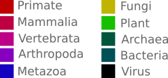

# palmID

`palmID` is a contained analysis suite for viral RNA-dependent RNA polymerases 
(RdRP) based on the "Palmprint" RNA virus barcodes described by
[Babaian and Edgar, 2022.](https://peerj.com/articles/14055/).

# {.tabset}

## Overview {.tabset}

```{r setup, include=FALSE}
# RMarkdown Setting Initialization
# Command Line Interface ----

# Rscript -e "rmarkdown::render( \
#   input = 'palmid_dev.Rmd', \
#   output_file = 'amexnv.html', \
#   output_format = 'html_notebook', \
#   params=list( input.path = 'amexnv/amexnv'))"

# ---------------------------

knitr::opts_chunk$set(warning = FALSE, message = FALSE)
```

```{css, echo=FALSE}
/* Move code folding buttons to the left */
div.col-md-12 .pull-right {
  float: left !important
}
```

```{r, include=FALSE, warning=FALSE}
# Run as Production Pipeline or Development
production.version = params$prod.run

if (production.version) {
  # Load stable palmid package
  library('palmid', quietly = T)
  data("palmdb") 

  # Disable warnings
   defaultW <- getOption("warn")
   options(warn = -1)
} else {
  # Warnings variable
  defaultW <- getOption("warn")
  options(warn = -1)

  # Compile a new palmid from source
  roxygen2::roxygenise()
  load("data/palmdb.RData")
}

```

```{r}
# INITIALIZE PALMID WORKSPACE -------------------
# library("palmid")

# Establish Serratus server connection
con <- SerratusConnect()

# Input file
# Generated within `palmid` container
# params are defined in YAML header to expose to CLI
input.path      <- params$input.path

if (is.null(input.path)) {
  stop("Error: No input provided.")
}

  input.fa      <- paste0(input.path, '.input.fa')   # palmscan-palmprint sequence
  input.pp      <- paste0(input.path, '.trim.fa')    # palmscan-palmprint sequence
  input.fev     <- paste0(input.path, '.fev')    # palmscan .fev report
  input.rep     <- paste0(input.path, '.txt')    # palmscan text motif-report
  input.pro     <- paste0(input.path, '.pro')    # diamond palmDB-alignment file
  input.msa     <- paste0(input.path, '.msa.fa') # muscle msa
  input.phy     <- paste0(input.path, '.phy') # tree file in newick format

# Output HTML Report
output.html   <- paste0(input.path, '.html')
save.plots    <- FALSE # save individual plots as png

# Parameters
  id_threshold    <- 0   # Minimum AA% to retain a hit
  max_palmdb_hits <- 200 # Maximum number of alignment hits in PalmDB hits to return

run.time <- Sys.time()

# IMPORT DATASETS -------------------------------
# Import a palmprint-analysis
pp.in <- read.fev(input.fev, FIRST = TRUE)

# Import a diamond-aligned pro file
pro.df <- read.pro(input.pro)
  # Populate with Nickname/Taxonomy-data
  pro.df$nickname     <- get.nickname(pro.df$sseqid, con, ordinal = T)
  pro.df              <- get.proTax2(pro.df, con)
  

# Import a phylogenetic tree file
tree.phy <- read.phy(input.phy)

# Get a dataframe from the tree phy object
tree.df <- get.proPhy(pro.df, tree.phy)

# Set backstop when too many similar hits come up
palmdb.hits <- length(pro.df$qseqid)
if (palmdb.hits > max_palmdb_hits) {
  pro.df <- pro.df[ 1:max_palmdb_hits, ]
  print.hitn <- paste0("Reporting Top ", max_palmdb_hits, "/", palmdb.hits, " matches")
} else {
  print.hitn <-  paste0("Reporting all ", palmdb.hits, " matches")
}

# SQL-Import of palmprint/sra meta-data
  # parent/child sOTU lookup, sra, biosample, date, organism, geo
  # optimization needed here
palm.sra <- get.palmSra(pro.df, con)

# SQL-import of STAT kmer taxonomic analysis of the retrieved
# matching SRA libraries
stat.sra <- get.sraSTAT(palm.sra$run_id, con)
# Populate stat.sra with percent identity from palm.sra
  stat.sra$pident <- palm.sra$pident[ match(stat.sra$run_id, palm.sra$run_id) ]
  

# GENERATE REPORT-PLOTS -------------------------
# Palmprint Report
pp.report <- PlotReport(pp.in, palmdb)

# Diamond-palmDB Alignment Report
pro.report <- PlotProReport(pro.df, html = T)

# PalmDB Viral Taxonomy Report
tax.report <- PlotTaxReport(pro.df)

# Phylogeny Report
phy.report <- PlotPhyReport(input.msa, tree.df, tree.phy)

# Geospatial distribution Report
geo.report  <- PlotGeo2(palm.sra)
date.report <- PlotTimeline(palm.sra)

# Host/Library organism Report
orgn.report <- PlotOrgn(palm.sra, freq = FALSE)
stat.report <- PlotSTAT(stat.sra)

# Print out version
cat( paste0("palmID Version: ", params$palmid.version) )

```

#### Summary

```{r, echo = FALSE}
# Generate text-based summary of palmID data
palm.summary <- text_summary(pp.in, pro.df, palm.sra, palmdb.hits)
cat(palm.summary)
```

#### Download Data {#download-data}

```{r, echo = FALSE}
options(warn = -1)

pro.df %>%
  downloadthis::download_this(
    output_name = paste0(input.path, '.pro'),
    output_extension = ".csv",
    button_label = "Download palmdb_alignment.csv",
    button_type = "success",
    has_icon = TRUE,
    icon = "fa fa-file-export"
  )

palm.sra %>%
  downloadthis::download_this(
    output_name = paste0(input.path, '.sra.metadata'),
    output_extension = ".csv",
    button_label = "Download sra_metadata.csv",
    button_type = "success",
    has_icon = TRUE,
    icon = "fa fa-file-export"
  )
```

## Input RdRP palmprint QC {.tabset}

#### palmscan motif analysis

Identification of the the core catalytic motifs A,B,C within the input sequence and reporting the "palmprint" RNA-virus barcode.

```{r, echo = FALSE}
# Input Sequence
cat("Input FASTA sequence: \n\n")
cat(paste0(readLines(input.fa), collapse = "\n"), "\n")
cat("\n")

# Palmscan-generated reports
cat("palmprint sequence: \n\n")
cat(paste0(readLines(input.pp), collapse = "\n"), "\n")
cat("\n")

cat("catalytic-motifs: \n")
cat(paste0(readLines(input.rep), collapse = "\n"), "\n")
cat("\n")

# lapply(scan(input.rep, 'character'),cat)[[1]]

```

#### palmprint QC-report

Quality control metrics on the motif-scores and size distribution of the "palmprint" informs the confidence that the input sequence contains a viral RdRP. Input scores are shown compared to score distribution from 15,010 canonical viral RdRP from GenBank. `Palmscan v1.0` (the motif-detection algorithm) has a sensitivity of 87%, and a positive predictive value of 99.89%. This is a conservative algorithm by design. While an RdRp score below `20` is deemed "Low Confidence", if you know your input is an RdRp it likely will retrieve the correct motifs. In general this tool is designed to "detect" RdRp motifs with a known RdRp input.

```{r, fig.height = 4.5, fig.width = 9}
# Palmscan QC-plot
plot(pp.report)
```

## MSA & Local Tree {.tabset}

#### Multiple Sequence Alignment

A `MUSCLE`-generated multiple sequence alignment of the input palmprint and
the top-10 matching palmprint in [`palmdb`](https://github.com/rcedgar/palmdb).
Header is palmprint_id and percent identity (aa%) alignment to input sequence.

```{r}
# Multiple Sequence Alignment of Top-10 hits in palmDB
cat(paste0(readLines(input.msa), collapse = "\n"))
```

#### UPGMA Tree of palmprint alignments

A _rough_ sketch (`MUSCLE` UPGMA tree) of the local evolutionary neighborhood of
the input palmprint and it's homologs in PalmDB. To generate an accurate tree,
use full-length, or as long as possible, RdRp sequences. Palmprints are not
sufficient to resolve phylogeny accurately.

```{r, fig.height = 5, fig.width = 10}
# Viral Taxonomy of palmDB Hits
plot(phy.report)
```
## Input Palmprint vs. PalmDB Analysis {.tabset}

#### Input palmprint alignment to palmDB

The extracted "palmprint" from input sequence is aligned against
[`palmdb`](https://github.com/rcedgar/palmdb) using `diamond` to retrieve 
related palmprints (upto 200 hits).
Each palmprint is also aligned against GenBank from which the top-hit
taxonomy and aa% identity is reported.

A "species" is not in palmDB if no point is right of the red vertical line.

A "species" is not in GenBank when point is below the gray horizontal dotted
line.


```{r, fig.height = 5, fig.width = 9}
# Protein-alignment of Input vs. palmDB
# Taxonomic Demarcations (~)
# Species >90%   - Red
# Genus   70-90% - Orange
# Family  45-70% - Green
# Phylum  <45%   - Purple

plotly::ggplotly(pro.report)

```


#### Virus Taxonomy of PalmDB matches

Species-, Genus- and Phylum- level taxonomy of the matching hits in
PalmDB allow for taxonomic-inference of the input virus.

```{r, fig.height=10, fig.width=16, retina = 1}
# Viral Taxonomy of palmDB Hits aligned against GenBank (top hit)
plot(tax.report)
```

#### palmDB Alignment table

```{r, echo = FALSE}
### Data-Table: `palmDB.csv`
# Data table for palmDB Alignment

blast.col <- linkBLAST(header = pro.df$sseqid,
                       aa.seq = pro.df$full_sseq)

cbind( pro.df[, c("sseqid", "nickname", "tspe", "pident", "evalue", "cigar")],
       blast.col) %>%
  DT::datatable(
    rownames = FALSE, filter = "top", escape = FALSE,
    options = list(pageLength = 10, scrollX = TRUE)
  )

```

[Download palmDB Alignment Table](#download-data)

## SRA Meta-data Analysis {.tabset}

RNA viruses matching input are cross-referenced against 5.7M SRA sequencing libraries to identify sra-virus matches and their associated meta-data.

#### Geospatial distribution of related RNA viruses

Distribution of matching RNA viruses. Click to explore each matching record. Species, genus, family and phylum level matches are red, orange, green and purple, respectively.

```{r, fig.height = 6, fig.width = 9}
# Geo-distribution of palmprint-containing SRA
# Taxonomic Demarcations (~)
# Species >90%   - Red
# Genus   70-90% - Orange
# Family  45-70% - Green
# Phylum  <45%   - Purple

geo.report
```


```{r, echo = FALSE, fig.height = 3, fig.width = 9}
# Geo-distribution of palmprint-containing SRA
plotly::ggplotly(date.report)
```

#### Virus-Organism Associations

Organism meta-data from the SRA sequencing libraries matching the input-virus. Word size and color is scaled by proximity of the input-virus to its match in the library. Wordclouds show a) Researcher provided annotations of the libraries or b) STAT automated taxonomic (orders) analysis of the reads contained within the library ([Katz et al.,2021](https://genomebiology.biomedcentral.com/articles/10.1186/s13059-021-02490-0)).

```{r, fig.width=8, fig.height=5, retina = 2}
# Plot SRA  Wordcloud - id
# (scaled by AA% proximity to input palmprint)
plot(orgn.report)
```

```{r, fig.width=8, fig.height=5, retina = 2}
# Plot SRA-Organism Wordcloud - freq
# (scaled by frequency in the SRA)
plot(stat.report)
```



#### Input Alignment to SRA-RdRp Table

```{r, echo = FALSE}
### Data-Table: `sra.metadata.csv`
# Data table for palmDB Alignment

blast.col <- linkBLAST(header = paste0(palm.sra$run_id,"_",palm.sra$palm_id),
                       aa.seq = palm.sra$sra_sequence )

cbind( palm.sra[, c("run_id", "biosample_id", 'palm_id', 'pident', 'coverage', 'evalue', 'scientific_name')],
       blast.col) %>%
  DT::datatable(
    rownames = FALSE, filter = "top", escape = F,
    options = list(pageLength = 10, scrollX = T)
  )

```

[Download SRA Metadata Table](#download-data)

#### Footer

-   [Source code](https://github.com/ababaian/palmid)
-   [Submit issue / ask
    question](https://github.com/ababaian/palmid/issues)

To save this report: `File` --\> `Save Page As`.

```{r, include=FALSE}
if (save.plots) {
  
  # SAVE PP-REPORT
  png(filename = output.report, width = 800, height = 400)
   plot(pp.report)
  dev.off()
  
  # SAVE PRO-REPORT 
  png(filename = output.pro, width = 800, height = 400)
    plot(pro.report)
  dev.off()
  
  # SAVE TAX-REPORT
  ggsave(output.tax,
    plot(tax.report),
    width = 16,
    height = 10,
    dpi = 72
  )
  
  # SAVE PHYLOGENY-REPORT 
  ggsave(output.phy,
    plot(phy.report),
    width = 16,
    height = 10,
    dpi = 72
  )
  
  # SAVE GEO-REPORT
  htmlwidgets::saveWidget(geo.report, file = output.geo)

  # SAVE ORGN-REPORT
  png(filename = output.orgn, width = 800, height = 400, res = 100)
    plot(orgn.report)
  dev.off()

}

```

```{r, include = FALSE}
# Development Code
# rmarkdown::render('palmid_dev.Rmd',
#                  output_file = output.html)

# # Generate /data files
# # based on waxsys example
# waxsys.palm.sra <- palm.sra
# waxsys.palmprint <- pp.in
# waxsys.pro.df <- pro.df
# waxsys.stat.sra <- stat.sra
# waxsys.tree.phy <- tree.phy
# waxsys.tree.df <- tree.df
# waxsys.input.msa <- input.msa

# save( waxsys.palm.sra, file = "data/waxsys.palm.sra.RData", compress = "xz")
# save( waxsys.palmprint, file = "data/waxsys.palmprint.RData", compress = "xz")
# save( waxsys.pro.df, file = "data/waxsys.pro.df.RData", compress = "xz")
# save( waxsys.stat.sra, file = "data/waxsys.stat.sra.RData", compress = "xz")
# save( waxsys.tree.phy, file = "data/waxsys.tree.phy.RData", compress = "xz")
# save( waxsys.tree.df, file = "data/waxsys.tree.df.RData", compress = "xz")
# save( waxsys.input.msa, file = "data/waxsys.input.msa.RData", compress = "xz")
```
